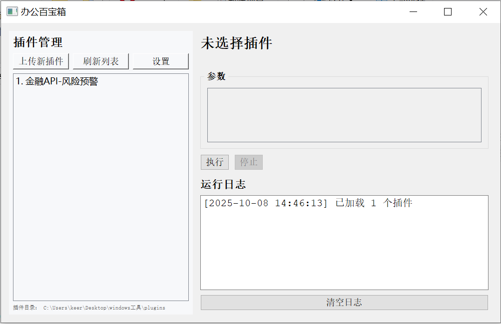
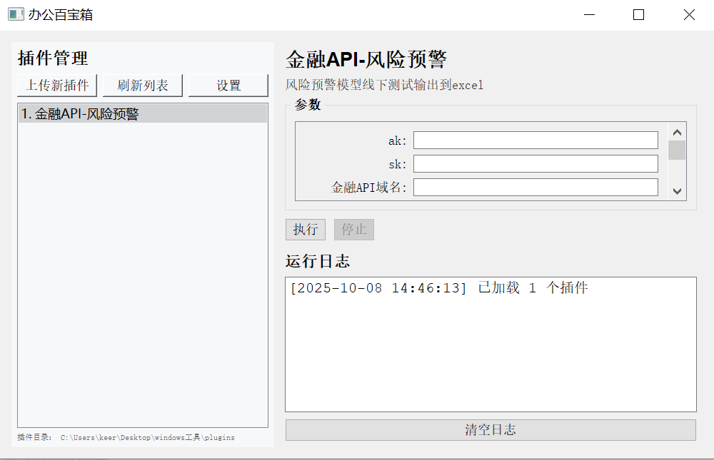
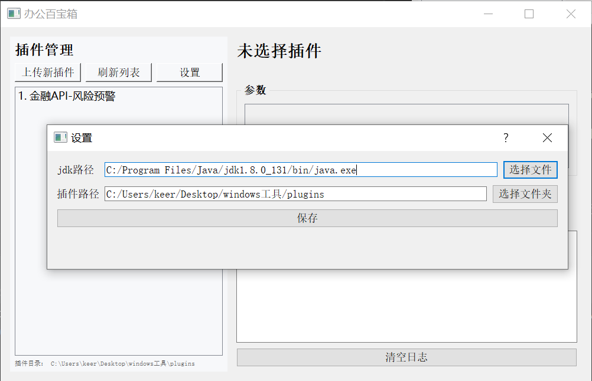

# windows 工具箱

## 1.介绍

本项目是一款windows工具箱，采用插件化的设计，支持不同脚本插件的运行，项目采用python编写，支持执行`bat`、`py`、`exe`和`jar`插件运行。目前支持到win7 32位系统

## 2.安装

首先需要安装32位python 3.7,下载本项目

- 安装依赖 `pip install -r requirement.txt`
- 打包`pyinstaller main.spec`
- 进入到`dist`文件夹,双击`worktoolbox.exe`即可运行

## 3.插件介绍

插件一般分位2个文件，插件介绍文件`plugin.json`和插件执行文件，

- `plugin.json`这个文件是非常重要的，它用来介绍插件和提供插件入口，每一个插件都会有一个单独的`plugin.json` 文件，且名字不能更改      
  插件介绍文件`plugin.json`内容如下：
    ```json
    {
      "name": "插件名称",
      "type": "插件类型，目前支持 bat，py，exe，jar",
      "description": "插件说明",
      "version": "插件版本",
      "entry": "插件入口文件名称，和插件执行文件名称保持一致",
      "args": [
        {
          "name": "参数名称",
          "label": "参数说明",
          "type": "参数类型，目前支持：folder，string，int，file，choice",
          "options": []
        }
      ]
    }
    ```
- `插件执行文件` :顾名思义真正的执行文件，可以是后缀为`bat`，`py`，`exe`，`jar`四种文件。
- 插件存放目录： 所有的插件必须要放在同一个目录下。并且每个插件需要有单独的目录
  

- 插件文件夹：在每个插件单独文件夹下，都需要有对应的`plugin.json` 和执行文件。
  

## 4.使用说明

### 4.1 打开软件

双击打开软件`worktoolbox.exe`,软件免安装，打开即用


### 4.2 选择插件

选择左侧列表中的插件，右侧就会显示执行参数


### 4.3 执行插件

填写插件相关参数，点击执行即可，插件的运行日志会显示在下放的空白区域。   
如果需要中途停止插件运行，点击停止按钮就可

### 4.4 相关配置

点击左侧上方`设置`按钮，进行配置

目前只有2个配置项：

- jdk路径：如果需要使用jar插件，需要在本地安装jdk，并进行选择
- 插件路径：需要将插件全部放在一个文件夹下，并进行选择。点击保存后，需要重新点击刷新列表，插件才会重新更新到插件列表中

### 4.5 上传新的插件
目前插件也支持上传自定义的插件，插件需要打包成`.zip`压缩包

点击软件中`上传新插件`,选择刚刚的压缩包，上传即可
